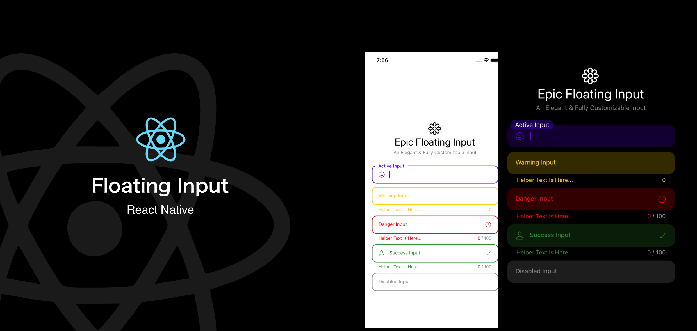
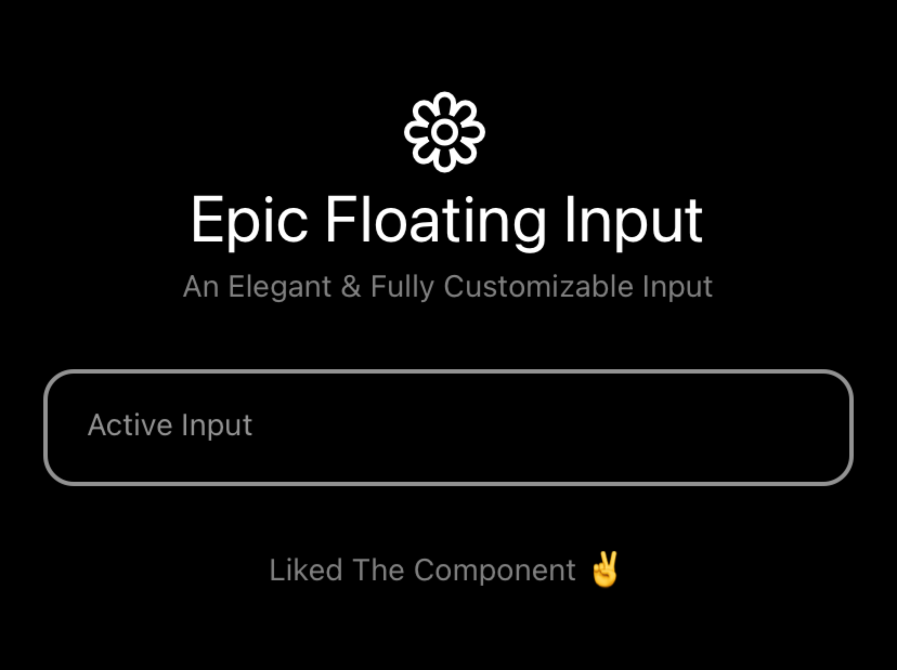
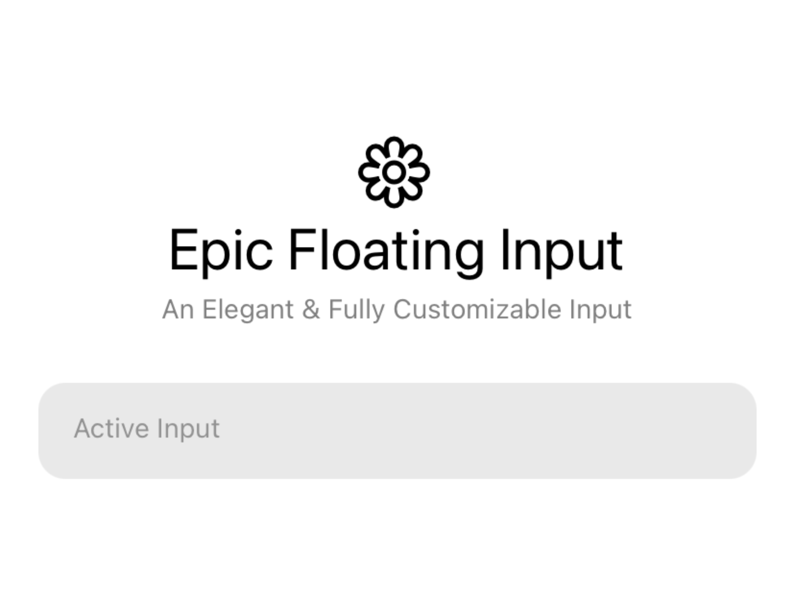

<div align="center">
<h1>Epic Floating Input</h1>

[](https://www.npmjs.com/package/epic-floating-input-react-native) [](https://www.npmjs.com/package/epic-floating-input-react-native) [](https://www.npmjs.com/package/epic-floating-input-react-native)



An elegant, fast & animated floating input component for react native

</div>

---

## Features

- `60FPS` smooth animation for all presets. 🔥
- Standalone usage. ✌️
- Compatible `Expo`.👌
- Runs smoothly on Both `Android` & `IOS`
- Written in `TypeScript`. ✨

## Installation

```sh
yarn add epic-floating-input-react-native
# or
npm install epic-floating-input-react-native
```

> Also, you need to install [react-native-vector-icons](https://github.com/oblador/react-native-vector-icons), and follow their installation instructions.

## Usage

```tsx
import * as React from "react";

import { StyleProp, Text, View, ViewStyle } from "react-native";
import { EpicFloatingInput } from "epic-floating-input-react-native";

export default function App() {

  const container: StyleProp<ViewStyle> = {
    flex: 1,
    justifyContent: "center",
    paddingHorizontal: 20,
  };

  return (
    <View style={container}>
	  // Just a Single Line Startup 🌟
      <EpicFloatingInput placeholder="Epic Floating Input" />
      //End
    </View>
  );
}

```


## Props

| name                 | description                                                                                         | required | type                                                                                                      | default  |
| -------------------- | --------------------------------------------------------------------------------------------------- | -------- | --------------------------------------------------------------------------------------------------------- | -------- |
| `type`             | Floating Input Theme `['primary','danger', 'warning', 'success', 'muted', 'tertiary']`.                                                                      | No |
| `theme`               | From this you can override the current theme of the input.                            | No      | `[primary: #hexCode ,danger: #hexCode, warning: #hexCode, success: #hexCode, muted: #hexCode, 'tertiary']`                                                                    |          |
| `inputStyle`              | `inputStyle` applied on the input container.    | NO       | StyleProp<ViewStyle>                                                                                      |          |
| `placeholder`           | placeholder text for the input.                               | Yes       | string                                                                                                    |          |
| `mode`             | specify the current mode [`dark`, `light`].                        | NO       | `dark` or `light` |          |
| `left`     | you can add icon to the left side of the input | NO       | IconProps | undefined                                                                   |          |
| `right`     | you can add icon to the right side of the input | NO       | IconProps | undefined                                                                    |          |
| `options` | more options for customizing the things.                  | NO       | EpicFloatingInputOptions                                                                                          |          |
| `helperText`           | Add helper text at the bottom of the input.                               | NO       | `string` or `React.ReactNode`                                                                                                    |          |
| `disabled`              | Disable the input.                                                             | NO       | boolean                                                                                                   | false    |
| `onChangeText`        | Callback on typing.                   | NO       | (text: string) => void                                                                                   |     |

### More Props

You can access all other react native `TextInput` props as well.

## Styles

Epic Floating Input has two type of styles `outline` and `solid`.

### Outline Style



### Solid Style




<h2 id="built-with">Built With ❤️</h2>

- [@react-native-community/bob](https://github.com/react-native-community/bob)
- [react-native-vector-icons](https://github.com/oblador/react-native-vector-icons)

## Author

- Abdullah Khan
- Saif Ali Khan

## License

MIT

<div align="center">

Liked the Component? 😇


---
